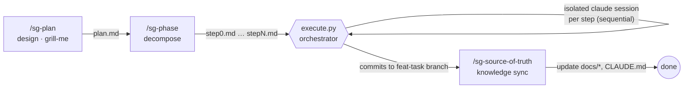

# sg-harness

> A Claude Code workflow harness that turns a large task into isolated, self-correcting steps — **design → decompose → execute → knowledge-sync**.

[](./LICENSE)
[](https://github.com/han0001/sg-harness)

---

## Why this exists

When you hand a large task to a single Claude session, quality decays as the context fills up: earlier decisions get blurry, unrelated files pile into the window, and one bad turn can derail the rest of the run.

sg-harness attacks that from a different angle. It **splits the work into small, self-contained steps and runs each one in its own fresh Claude session**, sequentially, with automatic retry-on-failure. Each step starts clean, sees only what it needs (the guardrail docs + a short summary of what previous steps produced), and commits its result before the next one begins.

The result is a repeatable pipeline instead of one long, drifting conversation.

---

## The workflow at a glance

sg-harness is a **plugin that ships three skills** plus one orchestrator script. You drive it phase by phase:



| Phase | Skill | Input | Output |
|-------|-------|-------|--------|
| **1. Design** | `/sg-plan` | your intent + `docs/`, `CLAUDE.md` | `plan/{yyyymmdd}_{task}/plan.md` |
| **2. Decompose + Execute** | `/sg-phase` | `plan.md` | `phases/{yyyymmdd}_{task}/step*.md` → runs them via `execute.py` |
| **3. Knowledge sync** | `/sg-source-of-truth` | `plan.md` + the git diff | reconciled `docs/*`, `CLAUDE.md` |

Each phase is independent — you can stop after design, review, and only then move on.

---

## How execution works

The interesting part lives in `skills/sg-phase/scripts/execute.py`, the orchestrator that turns a folder of `step*.md` files into commits. For every pending step it:

- **Spins up an isolated `claude -p` session** — one fresh session per step, so no cross-step context bleed.
- **Injects the guardrails** — the target project's `CLAUDE.md` and `docs/*.md` are prepended to every step prompt, so each session obeys the same rules.
- **Accumulates just enough context** — a one-line `summary` written on each step's completion is passed forward into the next step's prompt (not the whole transcript).
- **Self-corrects** — on failure it retries up to **3 times**, feeding the previous error back into the prompt.
- **Commits in two stages** — code changes as a `feat` commit, metadata/status as a separate `chore` commit, onto a dedicated `feat-{task}` branch.
- **Reports progress live** — driven one step at a time (`--once`), it streams a `✓ Step N/M — {summary}` line into the chat after each step, and only stops on `error` or `blocked`.

**Target = the git root of your current directory**, never the plugin's install location — so it always operates on the project you're standing in.

---

## Install

sg-harness is distributed as a Claude Code plugin from a single-plugin marketplace.

```text
# 1. Add this repo as a plugin marketplace
/plugin marketplace add han0001/sg-harness

# 2. Install the plugin from it
/plugin install sg-harness@han0001-plugins
```

The `skills/` and `hooks/` directories are auto-discovered from the plugin root — nothing else to wire up. (You can also browse and install interactively via the `/plugin` menu.)

---

## Quick start

Run the phases in order from inside a **git repository** (the harness refuses to run otherwise):

```text
/sg-plan             # interview + write plan/{date}_{task}/plan.md — no code yet
/sg-phase            # split plan.md into steps, then (after your approval) execute them
/sg-source-of-truth  # fold the decisions back into docs/ and CLAUDE.md
```

A typical run:

1. **`/sg-plan`** grills you one decision at a time and writes a `plan.md`. It never implements.
2. **`/sg-phase`** drafts a step breakdown for your review, creates the `step*.md` files, then — after a **single safety approval** — runs `execute.py` step by step, committing as it goes.
3. **`/sg-source-of-truth`** harvests what actually changed (plan + git diff) and proposes doc edits for you to approve.

---

## Repository layout

```text
sg-harness/
├── skills/
│   ├── sg-plan/SKILL.md               # design phase (grill-me → plan.md)
│   ├── sg-phase/
│   │   ├── SKILL.md                   # decompose + execute phase
│   │   └── scripts/
│   │       ├── execute.py             # the orchestrator (isolated session per step)
│   │       └── test_execute.py        # its tests
│   └── sg-source-of-truth/SKILL.md    # knowledge-sync phase
├── hooks/hooks.json                   # PreToolUse Bash safety guard
├── .claude-plugin/
│   ├── plugin.json                    # plugin manifest
│   └── marketplace.json               # single-plugin marketplace
├── CLAUDE.md                          # project memory (for developing sg-harness itself)
├── LICENSE
└── README.md
```

---

## Safety

Running code-writing sessions automatically is powerful, so the harness layers on guardrails:

- **A hook blocks dangerous commands.** `hooks/hooks.json` is a `PreToolUse` guard that refuses any Bash call matching `rm -rf`, `git push --force`, `git reset --hard`, or `DROP TABLE`.
- **Skip-permissions is gated.** `execute.py` runs each child session with `--dangerously-skip-permissions` and auto-commits — so it always asks for **one explicit approval** before the run starts, telling you exactly what it will do.
- **Only the orchestrator touches git.** Child sessions are forbidden from committing or pushing; branching/committing is done solely by `execute.py`. Pushing is opt-in via `--push`.

---

## Invariants & non-goals

**Invariants** (contracts that must always hold):

- Target is the **git root of cwd**, not the plugin's install path.
- **Only `execute.py` touches git.**
- **Step files are self-contained** — no references to an earlier conversation.
- Naming: top index `dir` = `{yyyymmdd}_{task}` (date included) ≠ per-task `phase` = `{task}` (date excluded).
- **Refuses to run outside a git repo.**

**Non-goals** (deliberately out of scope):

- No parallel step execution / no per-step worktrees — steps run **sequentially**.
- No deploy — the most it does is an opt-in `git push` to a `feat-*` branch.
- No multi-user / concurrency handling.

---

## Development

Run the orchestrator's test suite:

```bash
.venv/bin/python -m pytest skills/sg-phase/scripts/test_execute.py -q
```

See [`CLAUDE.md`](./CLAUDE.md) for the full development guide (purpose, invariants, and working discipline for hacking on the harness itself).

---

## License

[MIT](./LICENSE) © 2026 han0001
