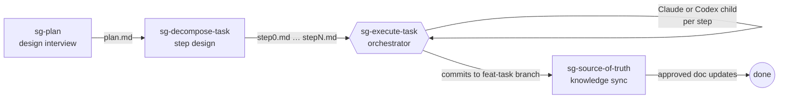

# sg-harness

> A Claude Code and Codex workflow harness for **design → decompose → execute → knowledge sync**.

[](./LICENSE)
[](https://github.com/han0001/sg-harness)

sg-harness turns a large task into small, self-contained steps and runs each step in a fresh child-agent session. The conversation host and child runtime are independent: you can use the skills from Claude Code or Codex and execute steps with either the Claude CLI or Codex CLI.

## Workflow


```mermaid
flowchart LR
    A["sg-plan<br/>design interview"] -->|plan.md| B["sg-decompose-task<br/>step design"]
    B -->|"step0.md … stepN.md"| C{{"sg-execute-task<br/>orchestrator"}}
    C -->|"Claude or Codex child<br/>per step"| C
    C -->|"commits to feat-task branch"| D["sg-source-of-truth<br/>knowledge sync"]
    D -->|"approved doc updates"| E(("done"))
```

| Stage | Skill | Input | Output |
|---|---|---|---|
| Design | `sg-plan` | user intent + repository docs | `docs/sg/plan/{yyyymmdd}_{task}/plan.md` |
| Decompose | `sg-decompose-task` | approved `plan.md` | `docs/sg/tasks/{yyyymmdd}_{task}/step*.md` |
| Execute | `sg-execute-task` | task index + step files | isolated child runs, normalized verdicts, commits |
| Knowledge sync | `sg-source-of-truth` | plan + task-owned git changes | proposed permanent-doc updates |

The planning interview is self-contained: it reads the repository first, asks one dependency-ordered question at a time with a recommendation, and waits for explicit approval before creating the plan. No external GrillMe skill is required.

## Host and runtime

- **Host:** the Claude Code or Codex conversation that runs an SG skill.
- **Runtime:** the CLI that performs an isolated implementation step.

Choose the runtime explicitly with `--runtime claude` or `--runtime codex`. The CLI default remains `claude` for backward compatibility; the `sg-execute-task` skill asks when no choice was provided and never auto-falls back to another provider.

| Runtime | Child command | Instruction precedence | Isolation / permissions |
|---|---|---|---|
| Claude | `claude -p` | `CLAUDE.md`, then `AGENTS.md` | permission checks disabled for the approved automated run |
| Codex | `codex exec` | `AGENTS.md`, then `CLAUDE.md` | ephemeral, non-interactive, `workspace-write` sandbox |

Only the first existing instruction file is injected, followed by top-level `docs/*.md`. Both runtimes must return the same JSON verdict schema before the common retry, state, and git flow accepts the result.

## How execution works

For each pending step, `skills/sg-execute-task/scripts/execute.py`:

- runs one fresh child-agent process;
- injects the selected project instructions and permanent docs;
- passes only completed-step summaries forward, not whole transcripts;
- validates the final verdict against one shared JSON Schema;
- retries failures up to three times with the previous error;
- commits code and state metadata separately on `feat-{task}`;
- reports progress after every `--once` call;
- pushes only when `--push` was explicitly requested.

The target is always the **git root of the current working directory**, never the plugin installation directory.

### Runtime preflight

Preflight runs before blocker checks, git operations, or state writes.

- Claude requires `claude >= 2.1.216` and verifies its structured-output and stream options.
- Codex uses capability detection instead of a version floor. It requires an authenticated CLI and `codex exec` support for `--json`, `--ephemeral`, `--sandbox`, `--output-schema`, and `--output-last-message`.

### Timeout controls

| Layer | Environment override | Default | Purpose |
|---|---|---:|---|
| Idle | `SG_T_IDLE_SEC` | 720 seconds | maximum gap between child events |
| Wall clock | `SG_T_MAX_SEC` | 5400 seconds | maximum duration of one attempt |
| Turns | `SG_MAX_TURNS` | 50 | Claude child tool-loop bound |
| Child Bash | `SG_BASH_MAX_TIMEOUT_MS` | 480000 ms | Claude child Bash timeout |

Invalid integer overrides produce a warning and use the default.

## Install

### Claude Code plugin

```text
/plugin marketplace add han0001/sg-harness
/plugin install sg-harness@han0001-plugins
```

Claude discovers `skills/` and `hooks/` from the plugin root.

### Codex local skill test

For local authoring, clone the repository and symlink its four skill directories into Codex's user skill directory:

```bash
git clone https://github.com/han0001/sg-harness "$HOME/plugins/sg-harness"
mkdir -p "$HOME/.agents/skills"
for sg_skill_path in "$HOME/plugins/sg-harness"/skills/sg-*; do
  ln -s "$sg_skill_path" "$HOME/.agents/skills/$(basename "$sg_skill_path")"
done
```

Codex supports symlinked local skills. Restart Codex if they do not appear. This path exercises the skills and bundled executor but not plugin-level hook installation.

### Codex full-plugin local test

Codex uses a local marketplace for full plugin testing. Clone the repository, then invoke `$plugin-creator` in Codex and ask it to register the existing checkout in your **personal marketplace without changing the plugin source**. Install using the marketplace name it reports:

```bash
codex plugin add sg-harness@<marketplace-name>
```

The personal marketplace is user-level state. This repository intentionally does not contain or modify `.agents/plugins/marketplace.json`. Public-directory submission is also outside the current scope.

## Quick start

Run the stages from the root of the target git repository.

In Claude Code, invoke the installed skills as slash commands:

```text
/sg-plan
/sg-decompose-task
/sg-execute-task
/sg-source-of-truth
```

In Codex CLI or the IDE extension, type `$` and select each installed SG skill, or let Codex invoke it from the task description. Tell `sg-execute-task` which child runtime to use, for example: “Execute this SG task with runtime codex.”

From a repository checkout, the executor can also be called directly:

```bash
python3 skills/sg-execute-task/scripts/execute.py 20260830_example --runtime claude --once
python3 skills/sg-execute-task/scripts/execute.py 20260830_example --runtime codex --once
```

Use `--push` only on the final call and only when a push is intended.

## Safety

- The host obtains one explicit approval before execution because the orchestrator creates/checks out a branch and commits automatically.
- Claude children use disabled permission checks only inside that approved run. Codex children use `workspace-write` and cannot request a new interactive approval.
- Only `execute.py` may branch, commit, or push. Child agents are told not to run git operations or edit task indexes.
- `hooks/hooks.json` blocks `rm -rf`, `git push --force`, `git reset --hard`, and `DROP TABLE` for supported `PreToolUse` Bash hooks. The core workflow does not depend on the hook being installed.
- A live smoke test runs child agents and changes a git repository, so it should be performed only with separate explicit approval.

## Repository layout

```text
sg-harness/
├── skills/
│   ├── sg-plan/SKILL.md
│   ├── sg-decompose-task/SKILL.md
│   ├── sg-execute-task/
│   │   ├── SKILL.md
│   │   └── scripts/
│   │       ├── execute.py
│   │       ├── runtimes/{base,claude,codex}.py
│   │       ├── schemas/verdict.schema.json
│   │       └── test_execute.py
│   └── sg-source-of-truth/SKILL.md
├── hooks/{hooks.json,test_hooks.py}
├── .claude-plugin/{plugin.json,marketplace.json}
├── .codex-plugin/plugin.json
├── AGENTS.md
├── CLAUDE.md
└── README.md
```

## Development

```bash
python3 -m pytest skills/sg-execute-task/scripts/test_execute.py hooks/test_hooks.py -q
python3 skills/sg-execute-task/scripts/execute.py --help
python3 /path/to/plugin-creator/scripts/validate_plugin.py .
```

CI runs the executor/runtime contract tests, both host hook fixtures, and manifest identity checks. See [`CLAUDE.md`](./CLAUDE.md) for repository invariants.

Codex packaging and local skill behavior follow the [official build-plugins](https://learn.chatgpt.com/docs/build-plugins) and [build-skills](https://learn.chatgpt.com/docs/build-skills) guidance.

## License

[MIT](./LICENSE) © 2026 han0001
